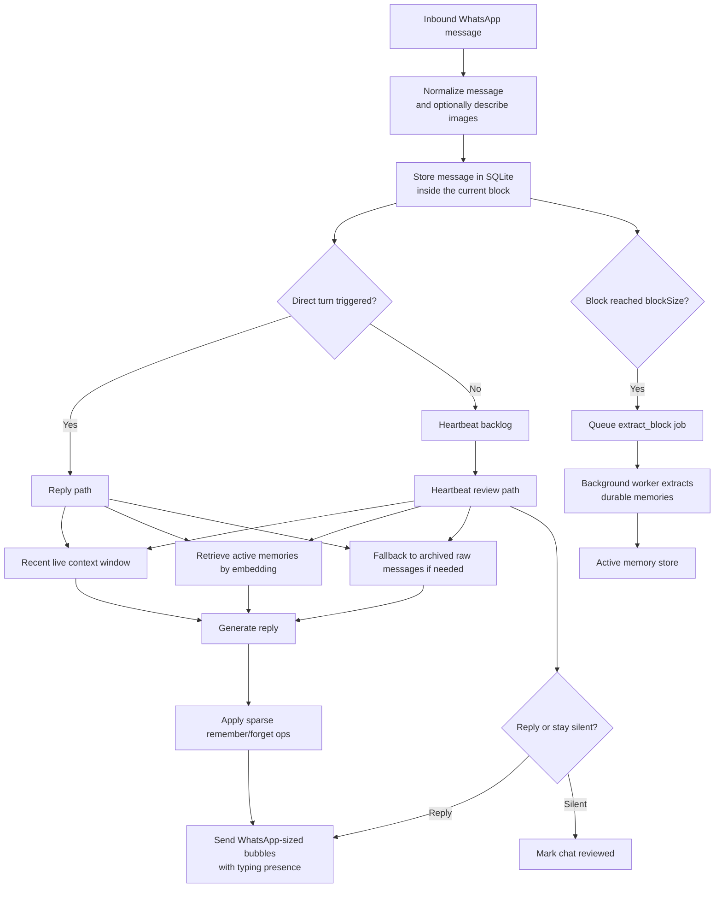

<p align="center">
  
</p>

# Luna AI
Memory-first WhatsApp bots with short-term context, long-term recall, and ambient presence.

<p>
  
  
  
  
  
</p>

Luna AI is an opinionated framework for building WhatsApp bots that feel like they actually know the people they talk to. It is built around a three-layer memory model:

- a hot recent window for what is happening right now
- durable long-term memories extracted from finished conversation blocks
- archive fallback over older raw messages when semantic memory is too thin

That lets the bot stay grounded without stuffing entire chat histories into every prompt. The result is cheaper prompts, cleaner behavior, and a bot that can feel consistent over time instead of stateless.

## Why Luna Feels Different

- **Three-layer memory, not just chat history.** Live turns get recent context, retrieved memories, and archive fallback.
- **Asynchronous memory extraction.** Closed conversation blocks are processed in the background into durable facts, preferences, relationships, events, and running jokes.
- **Heartbeat-driven ambient behavior.** The bot can periodically review chat backlog and decide whether to jump in or stay silent.
- **WhatsApp-native delivery.** QR auth, persistent sessions, typing presence, multi-bubble replies, and image descriptions are built in.
- **Cheap, portable ops.** Each bot lives in a single folder with persona, config, SQLite state, auth files, media, and logs.

## The Memory Model

### 1. Hot Context

Luna keeps a bounded recent window from the active conversation so the bot can answer the current turn without drowning in old noise.

### 2. Durable Memory

When a message block closes, the background worker extracts durable memories and stores them with embeddings. These become the bot's long-term recall layer.

### 3. Archive Fallback

If semantic memory retrieval is too sparse, Luna falls back to full-text search over older archived messages so the bot can still recover relevant raw context.

## Quick Start

### Fastest Path

```bash
curl -fsSL https://raw.githubusercontent.com/groovykiwi/luna-ai/main/scripts/install.sh | bash
```

The installer:

- clones the repo
- scaffolds `bots/<bot-id>/`
- writes `.env`
- offers WhatsApp QR authentication during install
- can start Docker for you immediately

### Manual Docker Setup

```bash
git clone git@github.com:groovykiwi/luna-ai.git
cd luna-ai
cp .env.example .env
# fill in OPENROUTER_API_KEY and confirm BOT_PATH / BOT_HOST_PATH
./scripts/init-bot.sh maya
```

Then edit the bot:

- `bots/maya/persona.md`
- `bots/maya/bot.json`
- `bots/maya/heartbeat.md`

Before the first real run, link WhatsApp:

```bash
./scripts/whatsapp-auth.sh --build-image
```

Then start Luna:

```bash
docker compose up -d
docker compose logs -f
```

## First-Time Bot Setup

The scaffold starts conservative. By default, the example `replyWhitelist` blocks both DMs and groups until you open them up.

This is the part that usually matters first:

```json
{
  "triggerNames": ["maya"],
  "replyWhitelist": {
    "groups": ["1203630XXXXXXXX@g.us"]
  }
}
```

Rules to remember:

- Omit `dms` to allow all DMs.
- Set `dms` to `[]` to block all DMs.
- Omit `groups` to allow all groups.
- Set `groups` to specific JIDs to allow only those groups.
- In groups, Luna only replies when it is mentioned, directly replied to, or its trigger name appears in the text.

## WhatsApp Authentication

You do not need to rely on detached Docker logs to catch a QR anymore. Luna ships with a dedicated auth command.

Run auth:

```bash
./scripts/whatsapp-auth.sh
```

Force a fresh QR login:

```bash
./scripts/whatsapp-auth.sh --reset
```

`--reinit` is supported as an alias for `--reset`.

Smoke-test the QR UX without touching real auth state:

```bash
./scripts/whatsapp-auth.sh --demo
```

See all options:

```bash
./scripts/whatsapp-auth.sh --help
```

Notes:

- If an auth session already exists, the command will reuse it and tell you so.
- Use `--reset` or `--reinit` when you want a brand new WhatsApp link.
- If Luna is already running, the auth helper stops the service, performs auth, and starts it again afterward.

## Heartbeats

Heartbeats let the bot review recent unaddressed chat activity and decide whether it wants to speak. This is how Luna can feel ambient instead of purely reactive.

Heartbeat behavior is driven by `heartbeat.md` in the bot folder. That file is part of the bot's personality layer: it tells Luna when it should jump in and when it should stay quiet.

Enable a fixed heartbeat:

```json
{
  "heartbeat": {
    "intervalMs": 300000,
    "batchSize": 8
  }
}
```

Or a random heartbeat interval:

```json
{
  "heartbeat": {
    "randomIntervalMs": [180000, 420000],
    "batchSize": 8
  }
}
```

Heartbeat behavior notes:

- Only one of `intervalMs` or `randomIntervalMs` can be set.
- `batchSize` controls how many unreviewed messages are considered per heartbeat pass.
- Heartbeats skip chats that already have a pending direct turn.
- A heartbeat can reply or explicitly stay silent.

## Bot Config That Matters

These are the fields you will tune most often in `bot.json`:

| Field | What it does |
| --- | --- |
| `triggerNames` | Names that trigger the bot in group chats. |
| `replyWhitelist` | Controls which DMs and groups the bot is allowed to answer. |
| `heartbeat` | Enables ambient reviews on a fixed or random interval. |
| `blockSize` | Number of messages per block before extraction is queued. |
| `bubbleDelayMs` | Delay range between multi-bubble WhatsApp replies. |
| `messagePrefix` | Prefix applied to every outbound bubble. |
| `retrievalMinHits` | Minimum semantic-memory hits before archive fallback kicks in. |
| `retainProcessedMedia` | Keeps inbound media on disk instead of pruning it after processing. |
| `models.main` | Main reply and heartbeat model. |
| `models.extract` | Memory extraction model. |
| `models.vision` | Inbound image description model. |
| `models.embed` | Embedding model for retrieval. |

## What Gets Stored

Each bot has its own folder under `bots/<bot-id>/`:

- `persona.md`: the voice and behavioral rules
- `heartbeat.md`: ambient participation instructions
- `bot.json`: runtime configuration
- `bot.db`: SQLite state, messages, blocks, jobs, and memory items
- `auth/`: WhatsApp session state
- `media/`: downloaded inbound media
- `logs/`: runtime logs

This layout makes bots easy to back up, move, and inspect.

## Local Development

Requirements:

- Node.js 22+
- `corepack` / `pnpm`
- `git`

```bash
corepack enable
pnpm install
pnpm approve-builds --all
cp .env.example .env
# fill in OPENROUTER_API_KEY and confirm BOT_PATH
./scripts/init-bot.sh maya
pnpm auth
pnpm worker
pnpm chat
```

Useful local commands:

- `pnpm auth`
- `pnpm reauth`
- `pnpm reinit`
- `pnpm test`
- `pnpm check`

## State and Portability

- Runtime state lives in `bots/<bot-id>/`.
- Copy `auth/` if you want to preserve the linked WhatsApp session.
- Do not copy `bot.db`, `media/`, or `logs/` to a fresh deployment unless you intentionally want to migrate state.

## How It Works



In practice the runtime is split into two long-running processes:

- **Chat process:** receives WhatsApp messages, stores them, decides whether a direct turn is triggered, runs heartbeats, and sends replies.
- **Worker process:** extracts long-term memories from closed blocks, reindexes memories, and prunes processed media.

## Why The Architecture Stays Small

Luna is intentionally narrow. It does not try to be a generic agent framework, a workflow engine, or a multi-channel CRM. The point is to run a WhatsApp bot with a strong persona, durable memory, selective ambient behavior, and low operational drag.
