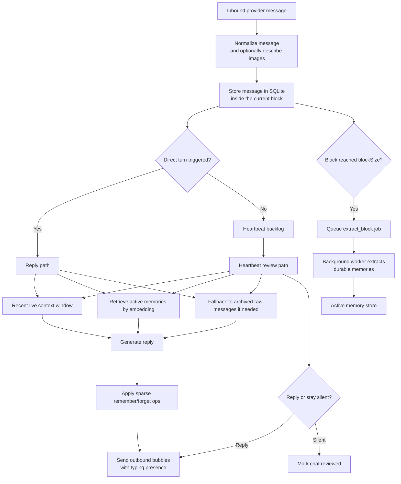

<p align="center">
  
</p>

# Luna AI
Memory-first chat bots with short-term context, long-term recall, and ambient presence.

<p>
  
  
  
  
  
</p>

Luna AI is an opinionated framework for building chat bots that feel like they actually know the people they talk to. It is built around a three-layer memory model:

- a hot recent window for what is happening right now
- durable long-term memories extracted from finished conversation blocks
- archive fallback over older raw messages when semantic memory is too thin

That lets the bot stay grounded without stuffing entire chat histories into every prompt. The result is cheaper prompts, cleaner behavior, and a bot that can feel consistent over time instead of stateless.

## Why Luna Feels Different

- **Three-layer memory, not just chat history.** Live turns get recent context, retrieved memories, and archive fallback.
- **Asynchronous memory extraction.** Closed conversation blocks are processed in the background into durable facts, preferences, relationships, events, and running jokes.
- **Heartbeat-driven ambient behavior.** The bot can periodically review chat backlog and decide whether to jump in or stay silent.
- **Provider-aware delivery.** WhatsApp gets QR auth and persistent sessions; Telegram gets BotFather token auth and long polling.
- **Cheap, portable ops.** Each bot lives in a single folder with persona, config, SQLite state, auth files, media, and logs.

## The Memory Model

### 1. Hot Context

Luna keeps a bounded recent window from the active conversation so the bot can answer the current turn without drowning in old noise.

### 2. Durable Memory

When a message block closes, the background worker extracts durable memories and stores them with embeddings. These become the bot's long-term recall layer.

### 3. Archive Fallback

If semantic memory retrieval is too sparse, Luna falls back to full-text search over older archived messages so the bot can still recover relevant raw context.

## Quick Start

### Fastest Path

```bash
curl -fsSL https://raw.githubusercontent.com/groovykiwi/luna-ai/main/scripts/install.sh | bash
```

The installer:

- clones the repo
- scaffolds `bots/<bot-id>/`
- writes `.env`
- offers unified auth setup during install
- can start Docker for you immediately

### Manual Docker Setup

```bash
git clone https://github.com/groovykiwi/luna-ai.git
cd luna-ai
cp .env.example .env
# fill in OPENROUTER_API_KEY
# BOT_PATH is used by local pnpm runs
# BOT_HOST_PATH is the host folder Docker mounts into /bot
# for simplicity, keep both set to the same bot folder in .env (for example ./bots/maya)
# set TELEGRAM_BOT_TOKEN too if you plan to use Telegram
./scripts/init-bot.sh maya
```

For Docker, `docker compose` mounts `BOT_HOST_PATH` from your machine into `/bot` inside the container and sets `BOT_PATH=/bot` there. For local `pnpm` runs, only `BOT_PATH` is read directly.

Then edit the bot:

- `bots/maya/persona.md`
- `bots/maya/bot.json`
- `bots/maya/heartbeat.md`

Before the first real run, run auth setup:

```bash
./scripts/auth-setup.sh --build-image
```

Then start Luna:

```bash
docker compose up -d
docker compose logs -f
```

## First-Time Bot Setup

The scaffold starts conservative. By default, the example provider configs block both DMs and groups until you open them up.

Shared runtime settings stay at the top level of `bot.json`. Provider-specific identity config lives inside `whatsapp` and `telegram`.

This is the shape Luna expects:

```json
{
  "provider": "whatsapp",
  "triggerNames": ["maya"],
  "messagePrefix": "",
  "heartbeat": {
    "intervalMs": 3600000,
    "batchSize": 8
  },
  "whatsapp": {
    "admins": [],
    "replyWhitelist": {
      "dms": [],
      "groups": ["1203630XXXXXXXX@g.us"]
    }
  },
  "telegram": {
    "admins": [],
    "replyWhitelist": {
      "dms": []
    }
  }
}
```

Rules to remember:

- Omit `dms` to allow all DMs.
- Set `dms` to `[]` to block all DMs.
- Omit `groups` to allow all groups.
- Set `groups` to specific JIDs to allow only those groups.
- In groups, Luna only replies when it is mentioned, directly replied to, or its trigger name appears in the text.
- `provider` defaults to `whatsapp` when omitted.
- Shared runtime settings live at the top level of `bot.json`.
- Provider blocks only hold provider-specific identifiers and allowlists such as `admins` and `replyWhitelist`.
- You can keep both provider sections in one file; Luna only uses the section selected by `provider`.
- Shared fields inside `whatsapp` or `telegram` are not supported.

## Auth Setup

Luna ships with a unified auth helper that can set up WhatsApp, Telegram, or both in sequence.

At startup, `./scripts/auth-setup.sh`:

- shows the current `BOT_PATH` and resolved bot ID
- lets you switch to another bot folder before doing any auth work
- writes the chosen `BOT_PATH` and `BOT_HOST_PATH` back into `.env` so local `pnpm` runs and Docker point at the same bot folder by default
- prefers Docker Compose when available, otherwise falls back to local `pnpm`
- bootstraps local `pnpm` dependencies automatically when Docker is unavailable and `node_modules` is missing

Run the helper and choose interactively:

```bash
./scripts/auth-setup.sh
```

Run WhatsApp only:

```bash
./scripts/auth-setup.sh --whatsapp
```

Run Telegram only:

```bash
./scripts/auth-setup.sh --telegram
```

If `TELEGRAM_BOT_TOKEN` is missing, the helper will prompt for it and save it to `.env`.

Run both:

```bash
./scripts/auth-setup.sh --both
```

Reset auth state before setup:

```bash
./scripts/auth-setup.sh --whatsapp --reset
```

Smoke-test the WhatsApp QR UX without touching real auth state:

```bash
./scripts/auth-setup.sh --whatsapp --demo-whatsapp
```

Build the Docker image before the first auth run:

```bash
./scripts/auth-setup.sh --build-image --both
```

See all options:

```bash
./scripts/auth-setup.sh --help
```

Notes:

- The helper can configure both providers even though only the provider selected by `bot.json` is used at runtime.
- If a WhatsApp auth session already exists, the command will reuse it and tell you so.
- Use `--reset` or `--reinit` to clear WhatsApp session state or to clear Telegram webhook configuration and pending updates before validation.
- Telegram uses a BotFather-issued token from `TELEGRAM_BOT_TOKEN`; it does not use QR auth or persisted local session files.
- If Luna is already running, the helper stops the service, performs setup, and starts it again afterward.

You can also call the auth CLI directly:

```bash
pnpm auth -- --provider whatsapp
pnpm auth -- --provider telegram
pnpm auth -- --provider whatsapp --demo-whatsapp
pnpm auth -- --provider telegram --reset
```

Shortcuts:

- `pnpm reauth` runs `pnpm auth -- --reset`
- `pnpm reinit` runs `pnpm auth -- --reinit`
- both shortcuts apply to the currently selected `provider` in `bot.json`

## WhatsApp ID Lookup

For WhatsApp config:

- `whatsapp.replyWhitelist.dms` expects the DM chat JID
- `whatsapp.replyWhitelist.groups` expects the group chat JID
- `whatsapp.admins` expects the sender JID

After someone sends the bot a WhatsApp DM or mentions it in a group, run:

```bash
./scripts/whatsapp-ids.sh
```

Local CLI equivalent:

```bash
pnpm whatsapp-ids
```

That prints the exact `bot.json` values Luna expects for DMs, groups, and admins.

## Telegram Setup

Telegram bots use a BotFather-issued token instead of QR auth.

1. Create the bot with `@BotFather`.
2. Put the token in `.env` as `TELEGRAM_BOT_TOKEN=...`.
3. Keep a `telegram` block in `bot.json`.
4. Run `./scripts/auth-setup.sh --telegram` or include Telegram in `--both`.

Current Telegram support is intentionally minimal:

- private chats only
- text messages only
- no groups, channels, or media handling yet
- long polling only; webhook hosting is intentionally out of scope

For Telegram config:

- `telegram.replyWhitelist.dms` expects `tg:chat:<chat_id>`
- `telegram.admins` expects `tg:user:<user_id>`
- in a normal 1:1 DM, the numeric `chat_id` and `user_id` are often the same number, but the prefixes are different and matter
- `telegram.replyWhitelist.groups` is currently not useful because Telegram groups are ignored in v1
- if Telegram private topics are enabled, Luna may store a DM as `tg:chat:<chat_id>:thread:<thread_id>`

After someone sends the bot a DM, run:

```bash
./scripts/telegram-ids.sh
```

Local CLI equivalent:

```bash
pnpm telegram-ids
```

That prints both values in the exact `bot.json` format Luna expects.

If you see a threaded chat ID like `tg:chat:123456789:thread:7`:

- paste that exact value into `telegram.replyWhitelist.dms` if you want to allow only that thread
- use `tg:chat:123456789` if you want to allow the whole DM across threads

## Heartbeats

Heartbeats let the bot review recent unaddressed chat activity and decide whether it wants to speak. This is how Luna can feel ambient instead of purely reactive.

Heartbeat behavior is driven by `heartbeat.md` in the bot folder. That file is part of the bot's personality layer: it tells Luna when it should jump in and when it should stay quiet.

Enable a fixed heartbeat:

```json
{
  "heartbeat": {
    "intervalMs": 300000,
    "batchSize": 8
  }
}
```

Or a random heartbeat interval:

```json
{
  "heartbeat": {
    "randomIntervalMs": [180000, 420000],
    "batchSize": 8
  }
}
```

Heartbeat behavior notes:

- Only one of `intervalMs` or `randomIntervalMs` can be set.
- `batchSize` controls how many unreviewed messages are considered per heartbeat pass.
- Heartbeats skip chats that already have a pending direct turn.
- A heartbeat can reply or explicitly stay silent.

## Bot Config That Matters

These are the fields you will tune most often in `bot.json`:

| Field | What it does |
| --- | --- |
| `provider` | Selects which provider block Luna will use: `whatsapp` or `telegram`. |
| `triggerNames` | Top-level. Names that trigger the bot in group chats. |
| `heartbeat` | Top-level. Enables ambient reviews on a fixed or random interval. |
| `blockSize` | Top-level. Number of messages per block before extraction is queued. |
| `bubbleDelayMs` | Top-level. Delay range between multi-bubble WhatsApp replies. |
| `messagePrefix` | Top-level. Prefix applied to every outbound bubble. |
| `retrievalMinHits` | Top-level. Minimum semantic-memory hits before archive fallback kicks in. |
| `retainProcessedMedia` | Top-level. Keeps inbound media on disk instead of pruning it after processing. |
| `models.main` | Top-level. Main reply and heartbeat model. |
| `models.extract` | Top-level. Memory extraction model. |
| `models.vision` | Top-level. Inbound image description model. |
| `models.embed` | Top-level. Embedding model for retrieval. |
| `whatsapp.admins` / `telegram.admins` | Provider block. Sender IDs treated as admins for prompting. |
| `whatsapp.replyWhitelist` / `telegram.replyWhitelist` | Provider block. Controls which DMs and groups the bot is allowed to answer on that provider. |

## What Gets Stored

Each bot has its own folder under `bots/<bot-id>/`:

- `persona.md`: the voice and behavioral rules
- `heartbeat.md`: ambient participation instructions
- `bot.json`: runtime configuration
- `bot.db`: SQLite state, normalized messages, archive search index, jobs, and memory items
- `auth/`: WhatsApp session state (Telegram does not use it)
- `media/`: downloaded inbound media
- `logs/`: runtime logs

`bot.db` contains real conversation content. Incoming provider payload JSON is stored short-term while a block is still being processed, then compacted after the block finishes. Message text, image descriptions, archive-search data, and memory embeddings remain in SQLite until you delete or migrate the bot state.

Treat `bot.db`, `media/`, and `logs/` as sensitive user data when backing up, sharing, or moving a bot.

This layout makes bots easy to back up, move, and inspect.

## Local Development

Requirements:

- Node.js 22+
- `pnpm` (or `corepack` if you want Node to provision `pnpm`)
- `git`

```bash
# optional if pnpm is not installed already
corepack enable
pnpm install
pnpm approve-builds --all
cp .env.example .env
# fill in OPENROUTER_API_KEY
# BOT_PATH should point at your bot folder for local pnpm runs
# BOT_HOST_PATH only matters for Docker; keep it the same for simplicity
# set TELEGRAM_BOT_TOKEN for Telegram bots
./scripts/init-bot.sh maya
pnpm doctor
pnpm auth
# terminal 1
pnpm worker
# terminal 2
pnpm chat
```

Useful local commands:

- `pnpm auth`
- `pnpm doctor`
- `pnpm reauth`
- `pnpm reinit`
- `pnpm telegram-ids`
- `pnpm whatsapp-ids`
- `./scripts/auth-setup.sh`
- `./scripts/telegram-ids.sh`
- `./scripts/whatsapp-ids.sh`
- `pnpm test`
- `pnpm check`

## State and Portability

- Runtime state lives in `bots/<bot-id>/`.
- Copy `auth/` if you want to preserve the linked WhatsApp session.
- Do not copy `bot.db`, `media/`, or `logs/` to a fresh deployment unless you intentionally want to migrate state.

## How It Works



In practice the runtime is split into two long-running processes:

- **Chat process:** receives WhatsApp or Telegram messages, stores them, decides whether a direct turn is triggered, runs heartbeats, and sends replies.
- **Worker process:** extracts long-term memories from closed blocks, reindexes memories, and prunes processed media.

## Why The Architecture Stays Small

Luna is intentionally narrow. It does not try to be a generic agent framework, a workflow engine, or a multi-channel CRM. The point is to run a persona-driven bot with durable memory, selective ambient behavior, and low operational drag, with shared runtime config at the top of `bot.json` and provider-specific identity blocks for WhatsApp and Telegram selected by `provider`.
